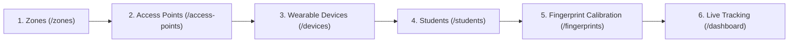

# ChildTrack — User & Operator Manual

Comprehensive operational guide for setting up, configuring, calibrating, and testing ChildTrack.

---

## 1. Quick Start: Launching ChildTrack

### 1.1 Prerequisites
- Python 3.11+ installed.
- Repository cloned and virtual environment ready (`venv` at project root).

### 1.2 Start the Server
Open a terminal in the `child-tracker-app/backend` folder and run:

```powershell
# From child-tracker-app\backend directory:
..\..\venv\Scripts\python.exe -m uvicorn app.main:app --reload --host 0.0.0.0 --port 8000
```

The application will start at: **`http://localhost:8000`**

### 1.3 Default Credentials
Visit `http://localhost:8000` in your web browser. You will be redirected to `/login`:

- **Email**: `admin@childtrack.local`
- **Password**: `Admin@12345`

*(Teachers can also be created via the admin interface with email/password and assigned role `teacher`).*

---

## 2. Setting Up Your Campus Topology (Step-by-Step)

Follow this natural order to set up your school configuration:



### Step 1: Create Physical Zones
1. Click **Zones** in the sidebar (or navigate to `/zones`).
2. Click **+ Add Zone**.
3. Enter details:
   - **Zone Name**: e.g., `Classroom 101`, `Library`, `Playground`, `Cafeteria`, `Server Room`.
   - **Building**: e.g., `Main Wing`, `North Wing`.
   - **Floor**: e.g., `1st Floor`, `Ground Floor`.
4. Click **Save Zone**.
5. Repeat for all monitored rooms and restricted areas.

---

### Step 2: Register Reference Wi-Fi Access Points
1. Click **Access Points** in the sidebar (or go to `/access-points`).
2. Click **+ Register Access Point**.
3. Fill in:
   - **AP Name**: e.g., `AP-Classroom-101-Primary`.
   - **BSSID (MAC Address)**: The hardware MAC of your Wi-Fi router or access point (e.g. `24:F5:A2:33:44:01`).
   - **Wi-Fi Channel**: e.g. `1`, `6`, or `11`.
   - **Physical Zone**: Select the zone where this router is physically located.
4. Click **Register Access Point**.

---

### Step 3: Register ESP32 Wearable Tags
1. Click **Wearables** in the sidebar (or go to `/devices`).
2. Click **+ Register Wearable**.
3. Fill in:
   - **Device Code**: e.g., `WB-001`, `TAG-ALPHA-01`.
   - **MAC Address**: The ESP32's built-in Wi-Fi station MAC address (e.g. `A4:CF:12:88:99:01`).
4. Click **Register Device**.

---

### Step 4: Enroll Students & Set Safe Zone Whitelists
1. Click **Students** in the sidebar (or go to `/students`).
2. Click **+ Enroll Student**.
3. Fill in:
   - **Full Name**: e.g., `Alice Wonder`.
   - **Student Code**: e.g., `STU-101`.
   - **Class / Grade**: e.g., `Grade 3A`.
   - **Age**: e.g., `8`.
   - **Assign Wearable Tag**: Select `WB-001`.
   - **Allowed Safe Zones**: Check the boxes for the zones this student is authorized to enter (e.g. `Classroom 101`, `Library`, `Playground`). Any unselected zones (like `Server Room`) will automatically trigger a **Security Alert** if the child enters them!
4. Click **Enroll Student**.

---

## 3. Wi-Fi Fingerprint Calibration (Zero-Manual Typing)

Before real-time localization can pinpoint a student to a room, the physical room must be calibrated with a radio survey.

### How to Calibrate a Room:
1. Navigate to **Fingerprints** in the sidebar (`/fingerprints`).
2. Click **+ New Survey**.
3. Select the Zone (e.g., `Classroom 101`), check the whitelist APs you want to monitor, and keep the noise cutoff at `-85 dBm`.
4. Click **Start Calibration Survey** &rarr; You will be taken to the **Calibration Dashboard** (`/fingerprints/{id}/calibrate`).
5. **Collect Samples**:
   - **Option A (Simulated testing)**: Click the button **⚡ Simulate 5 Scans Burst** 4 or 5 times until the sample counter reaches `20 / 20` or higher.
   - **Option B (Real ESP32)**: Turn on your ESP32 calibration tool; it will stream bursts to `/api/v1/fingerprints/{id}/samples` automatically.
6. Once sufficient samples are collected, click **Finalize & Activate Calibration**.
7. The room is now calibrated! Its variance-weighted radio model is cached in memory for real-time localization.

---

## 4. How to Test & Simulate Live Child Tracking

You can test the entire tracking and alerting loop right from your terminal without physical hardware!

### Scenario A: Normal In-Room Tracking (Student in Safe Classroom)
Simulate child `Alice Wonder` (wearable `WB-001`) reporting Wi-Fi signals inside `Classroom 101`:

```powershell
# Run in PowerShell:
Invoke-RestMethod -Uri "http://localhost:8000/api/v1/tracking/ingest" `
  -Method POST `
  -ContentType "application/json" `
  -Body '{
    "device_id": "WB-001",
    "mac_address": "A4:CF:12:88:99:01",
    "battery_percent": 90,
    "scan": [
      {"bssid": "24:F5:A2:33:44:01", "rssi": -50, "channel": 1}
    ]
  }'
```

**Expected Result**:
- Server returns `200 OK` with `assigned_zone: "Classroom 101"`, `confidence >= 0.85`.
- Visit `/dashboard` &rarr; `Classroom 101` occupancy increases by 1. Alice's avatar chip appears in Classroom 101!

---

### Scenario B: Restricted Safe Zone Violation (Out-of-Bounds Alert)
Simulate Alice entering an unauthorized room (e.g. `Server Room`):

```powershell
Invoke-RestMethod -Uri "http://localhost:8000/api/v1/tracking/ingest" `
  -Method POST `
  -ContentType "application/json" `
  -Body '{
    "device_id": "WB-001",
    "mac_address": "A4:CF:12:88:99:01",
    "battery_percent": 88,
    "scan": [
      {"bssid": "<BSSID_OF_SERVER_ROOM>", "rssi": -48, "channel": 6}
    ]
  }'
```

**Expected Result**:
- Alice's card on `/dashboard` turns red: `🚫 Outside permitted safe zones!`
- Server raises a **CRITICAL** Alert: `RESTRICTED ZONE VIOLATION`.
- Navigation bell badge increments by `1`.
- Clicking the alert bell (or going to `/alerts`) shows the incident with single-click **Acknowledge** and **Resolve** buttons!

---

### Scenario C: Low Battery Alert
Simulate wearable battery dropping to 15%:

```powershell
Invoke-RestMethod -Uri "http://localhost:8000/api/v1/tracking/ingest" `
  -Method POST `
  -ContentType "application/json" `
  -Body '{
    "device_id": "WB-001",
    "mac_address": "A4:CF:12:88:99:01",
    "battery_percent": 15,
    "scan": [
      {"bssid": "24:F5:A2:33:44:01", "rssi": -55, "channel": 1}
    ]
  }'
```

**Expected Result**:
- Dashboard displays yellow attention pill and battery: `🔋 15%`.
- Automated background sweep generates a `LOW_BATTERY` warning alert.

---

### Scenario D: Triggering Automated Background Safety Sweeps
Admins can manually trigger the background safety sweep at any time from the `/alerts` page by clicking **⚡ Run Safety Sweep Now**, or via curl:

```powershell
# Trigger instant safety audit sweep:
Invoke-RestMethod -Uri "http://localhost:8000/api/v1/alerts/sweep" `
  -Method POST `
  -Headers @{ "Authorization" = "Bearer <YOUR_ADMIN_JWT_TOKEN>" }
```

---

## 5. Running the Automated Test Suite

To verify system health and test all 46 test cases across all modules:

```powershell
# From child-tracker-app\backend:
..\..\venv\Scripts\pytest.exe tests/ --show-capture=no
```

All tests will run and pass green:
```text
====================== 46 passed, 12 warnings in 9.44s =======================
```

---

## 6. Page Map Quick Reference

| Route | Purpose | Role |
|---|---|---|
| `/dashboard` | Live real-time safety monitoring command center | All |
| `/students` | Enrolled children directory & safe zone permissions | All |
| `/students/{id}/history` | Individual child historical movement breadcrumbs timeline | All |
| `/alerts` | Safety incidents log & triage (acknowledge/resolve) | All |
| `/zones` | Physical rooms & school area management | Admin |
| `/access-points` | Reference router BSSID management | Admin |
| `/devices` | Wearable hardware tags & battery monitoring | Admin |
| `/fingerprints` | Radio survey calibration dashboard | Admin |
| `/settings` | Institutional thresholds & offline timeout configuration | Admin |
